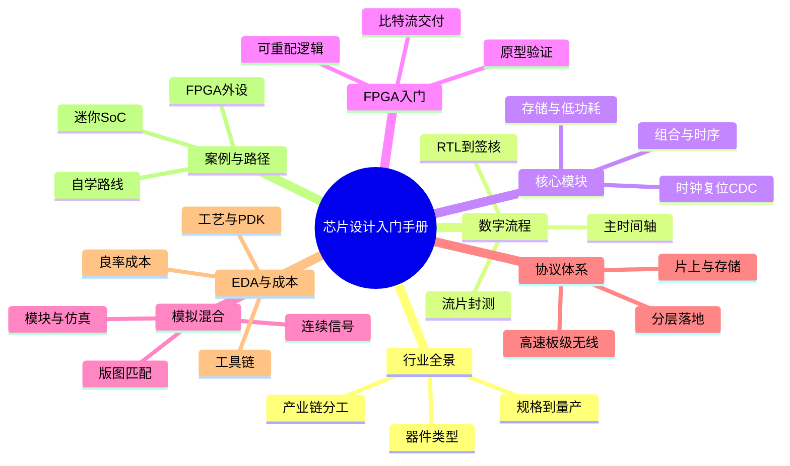

# 芯片设计入门：八篇如何串起来

这本手册不按「先背公式再写代码」组织，而是先给你一张从行业到硅片的地图。第一篇分清芯片、岗位和从规格到量产的大图；第二篇沿数字 ASIC/SoC 主时间轴走完 RTL、验证、综合、时序、DFT、后端和流片。第三篇拆开数字积木，第四、五篇分别用 FPGA 和模拟换一套实现与思维方式。第六篇按落地结构讲协议，第七篇看工具、工艺和成本，第八篇用案例把前面的名词重新走一遍。读完全书，你应能按「流程—模块—协议」三条线开口讲清一颗芯片怎么做出来。

