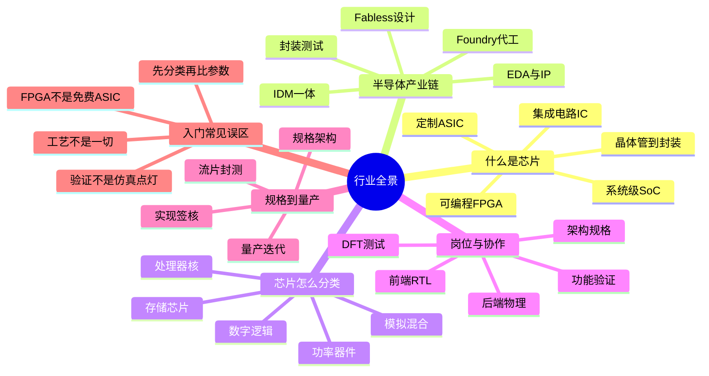

# 行业全景思维导图

入门第一件事是分清你在谈哪一类器件：IC 是总称，ASIC 功能锁定，SoC 是一颗缩微系统，FPGA 可反复配置。接着看产业链：谁定义功能、谁把电路做进硅、谁保证出厂质量，以及 EDA 与 IP 如何贯穿全程。分类尺子帮助你选对工具和团队；岗位图告诉你前端、验证、后端、DFT 各自守哪一段。最后用「规格到量产」把设计公司内部流程嵌进代工和封测，并清理把工艺节点当唯一指标、把 FPGA 当免费 ASIC 这类误区。本篇读完，后面所有流程章节都有落点。

