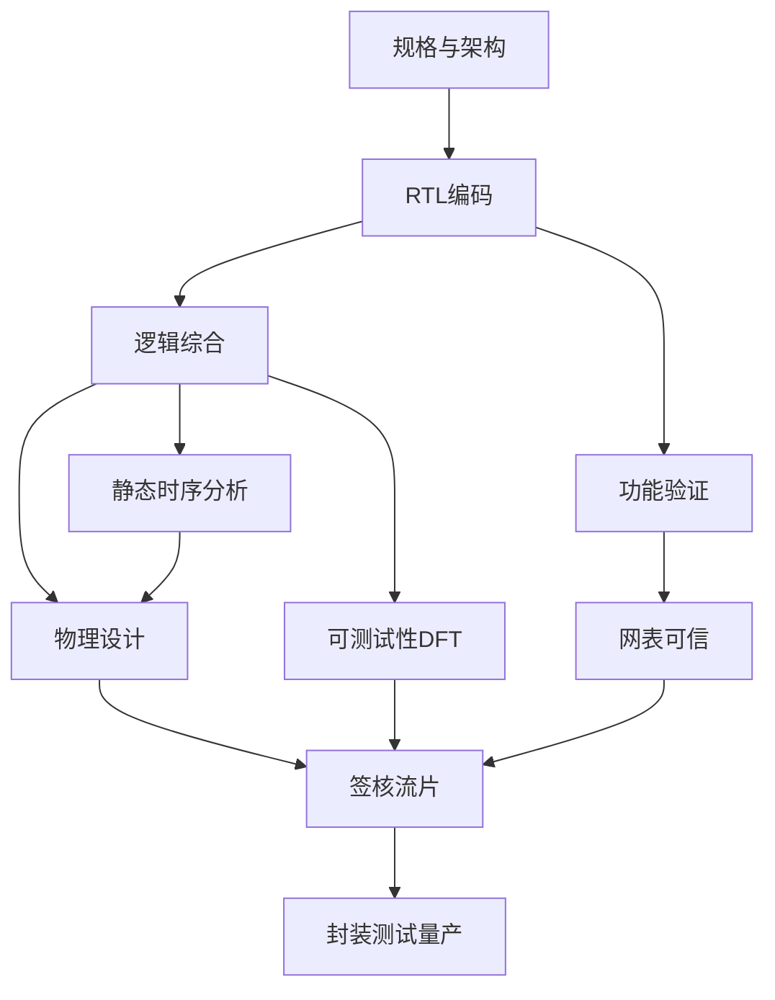

# 数字芯片设计流程思维导图

数字 ASIC/SoC 是全书主时间轴：先把规格写成可实现的架构和微架构，再用 RTL 描述寄存器传输行为。功能验证证明「该算的都算对」，逻辑综合把 RTL 映射成带工艺库的门级网表，静态时序分析检查建立/保持是否在时钟拍内走完。DFT 为量产测试插入扫描和自测试结构；物理设计完成布局、时钟树和布线；签核通过后交出 GDS，进入流片、封装和测试。各站不是线性甩手：验证与综合可并行准备，时序闭环会打回 RTL 或约束，DFT 必须在签核前收口。

