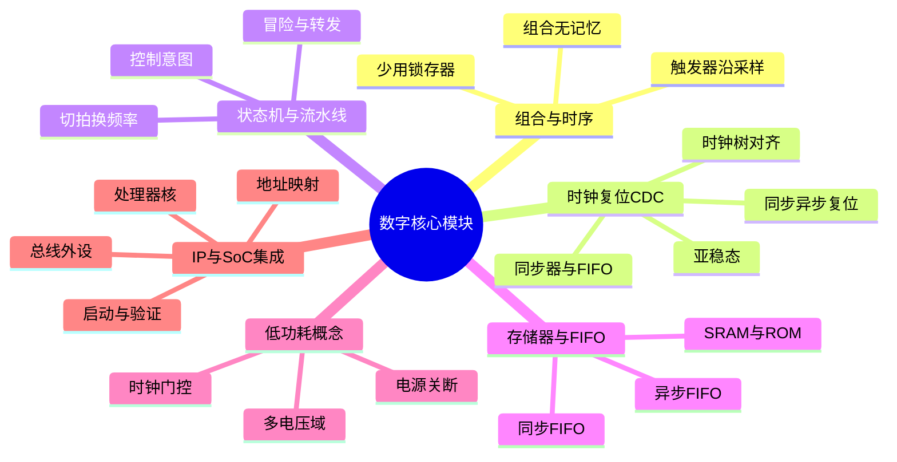

# 数字设计核心模块思维导图

流程章节告诉你芯片怎么「做出来」，本篇告诉你硅片里面用哪些积木。组合逻辑负责算、时序逻辑负责记，触发器在时钟沿把连续计算切成拍。时钟树、复位策略和跨时钟域同步决定系统能不能可靠起步和交换数据。状态机表达控制意图，流水线用切拍换频率。SRAM、ROM 与 FIFO 是带宽和弹性的存储器词汇；时钟门控、多电压和电源关断是低功耗三件套。最后，绝大多数 SoC 不是从门画起，而是把 CPU、总线、存储和接口 IP 集成并验证到可启动。读模块是为了读懂架构图，不是为了背单元清单。

