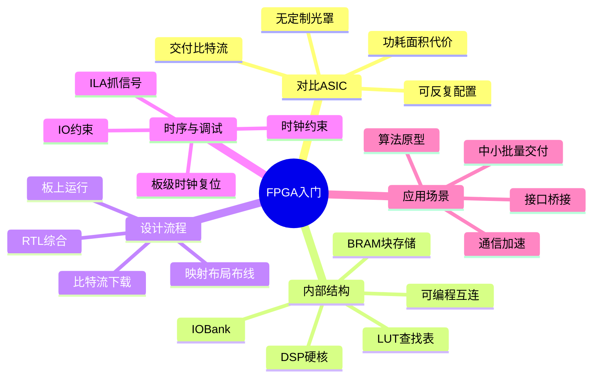

# FPGA 入门思维导图

FPGA 用查找表和可编程互连「搭」逻辑，出厂不锁死功能，改配置就能改电路，因此适合原型、中小批量和需要现场升级的产品。它与 ASIC 的关键差别在交付物：FPGA 产出比特流，通常不必为每一版功能定制光罩；代价是面积、功耗和时序余量往往不如同功能 ASIC。内部要认识 LUT、触发器、BRAM、DSP 和高速 IO Bank。流程是综合、实现（映射/布局/布线）、生成比特流、上板；约束和板级调试（ILA、抓信号）决定能不能在真实时钟下跑稳。应用上，它既是 ASIC 前的验证平台，也是通信、图像和加速卡里的正式器件。

