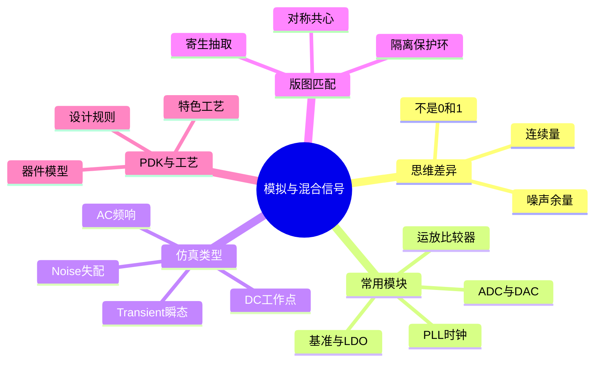

# 模拟与数模混合思维导图

模拟设计处理连续电压电流，目标从「逻辑对不对」变成噪声、匹配、线性度、稳定性和功耗。常用模块包括运放、比较器、基准、LDO、ADC/DAC、PLL 和射频前端，它们在 SoC 里负责感知、供电和时钟。仿真按问题分型：DC 找工作点，AC 看带宽相位，Transient 看建立与过冲，Noise 和蒙特卡洛评估随机与失配。版图不是「画得下就行」：匹配、对称、隔离和寄生会改电路行为。PDK 给出器件模型、规则和标准单元，工艺选择决定速度、电压和成本。数字工程师不必会画运放，但必须知道混合信号芯片为何不能只用功能仿真收工。

