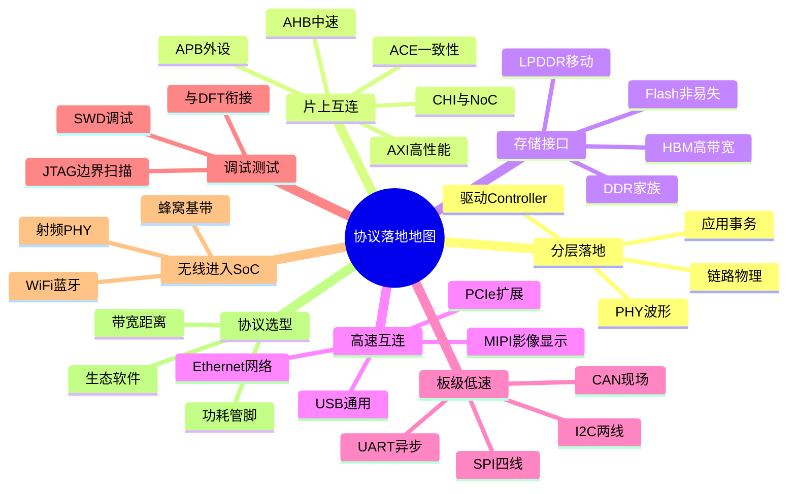

# 完整协议体系思维导图

协议篇不堆字段，只回答「芯片里协议如何落地」。规范分层（应用/事务/链路/物理）对应硅上的软件驱动、数字 Controller 和 PHY。片上互连用 AXI/AHB/APB 把主设备连到从设备，多核再升级到一致性总线和 NoC。存储接口（DDR/LPDDR/HBM/Flash）决定带宽与封装；高速互连和多媒体接口走 SerDes 与专用 PHY。板级低速口（I2C/SPI/UART/I2S/CAN/GPIO）是传感器和配置的日常语言；JTAG/SWD 把调试和测试连到同一颗硅。无线进 SoC 仍是 Controller+射频 PHY+协议栈。选型时按带宽、距离、功耗、管脚和软件生态画地图，而不是按名词时髦程度下单。

