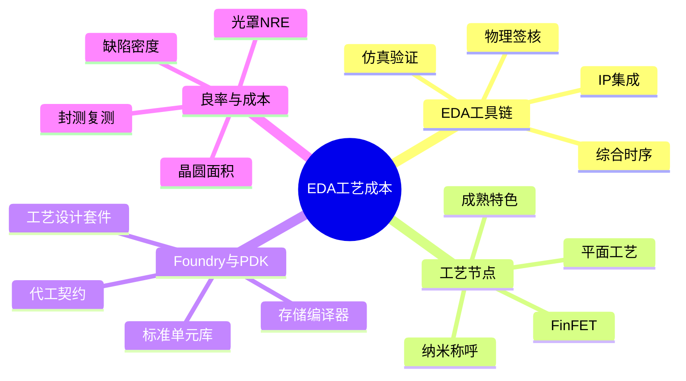

# EDA、工艺与成本思维导图

设计能力不只取决于会不会写 RTL，还取决于工具链、工艺节点和晶圆厂规则能不能支撑你的规格。EDA 覆盖仿真、综合、时序、DFT、布局布线和签核，三大厂商工具常按流程拼在一起，IP 与工艺库也嵌在这条链里。工艺节点的纳米数字是营销尺子，不是晶体管的精确边长；FinFET、FD-SOI 和成熟平面工艺各有成本与性能画像。Foundry 提供 PDK、标准单元和存储编译器，设计侧必须按这套契约做实现。良率、光罩、晶圆面积、封装测试和 NRE 共同决定一颗芯片贵不贵。本篇让你读新闻和报价时，能把「先进制程」从口号还原成约束。

