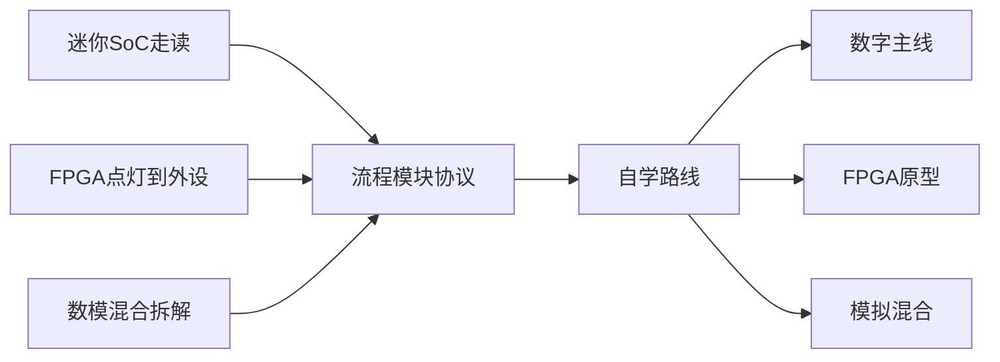

# 走读案例与学习路径思维导图

前七篇把名词铺开，本篇用三条走读把它们重新咬合。迷你 SoC 让你沿 CPU、总线、存储、外设和启动代码走一遍数字主流程。FPGA 从点灯到外设，把约束、时钟、低速协议和板级调试连成可上手的练习链。数模混合拆解则逼你同时看到数字控制器、模拟前端和协议落地，避免「只会讲数字或只会讲运放」。自学路线强调先建立流程地图，再选一条主线深挖（数字前端/验证、FPGA、或模拟），并用误区清单防止过早沉迷工艺节点或协议字段。案例不是项目交付，而是把手册读成可以开口讲解的故事。

