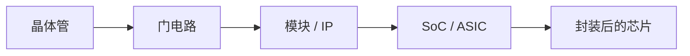

## 一句话定义

芯片是把大量晶体管做在一小块半导体上，用来计算、存储或转换电信号的器件；日常说的芯片，大致对应集成电路（IC）。

## 作用与功能

芯片的本领，是把「开关」堆成「系统」。单个晶体管只负责通或断；许多晶体管组成与、或、非等门电路；门电路再组成加法器、寄存器、存储器和接口。放到产品里，它可能负责运算、存数据、放大模拟信号，或驱动电机。

几个常被混用的词要分开：IC 是总称，强调把电路集成到硅片上。ASIC 是面向某一用途定制的 IC，比如某款手机里的基带或某台仪器里的采集芯片，功能相对固定。SoC（系统级芯片）是把处理器、总线、存储控制器、外设和部分模拟模块装进同一颗硅片，几乎就是一块「缩微主板」。FPGA 出厂时电路并不锁死，用查找表和可编程互连来「搭」逻辑，改配置就能改功能，适合原型验证和中小批量产品。

从尺度上看：纳米级是晶体管，微米到毫米级是模块和内核，厘米级是封装后的芯片。读规格时，先问「这是通用处理器、专用 ASIC，还是可编程的 FPGA」，再谈工艺和性能。同一颗产品里也可能同时出现这几类：主芯片是 SoC，旁边有电源 ASIC，开发阶段还用 FPGA 做对照。先分清手里拿的是哪一种，后面的流程和岗位才对得上号。

## 在全流程中的位置

「什么是芯片」是全书的入口。后面谈产业链、岗位和从规格到量产，都默认你能分清：设计的是哪一类器件、最后落在硅片上的是固定电路还是可重配电路。数字 ASIC/SoC 走 RTL、验证、综合、后端、流片；FPGA 走综合、布局布线、生成比特流，通常不进晶圆厂定制光罩。

## 典型应用场景

手机里的应用处理器是典型 SoC：CPU、GPU、ISP、调制解调器和电源管理常常做成一颗或几颗芯片。工业相机里的图像处理 ASIC 为固定算法定制，功耗和成本可控。实验室用 FPGA 开发板快速试算法，确认无误后再决定是否转成 ASIC。存储条上的 DRAM、电源上的功率器件，也都是芯片，只是功能类别不同。

## 一个小例子

把芯片想成「城市」：晶体管是砖，标准单元是房间，处理器核是街区，总线是马路，封装引脚是城门。ASIC 像按图纸盖好的园区，建成后不好改路；FPGA 像可重组的展馆，隔墙能拆能搭；SoC 则是一座功能齐全的城，住宅、仓储、出入口都在同一围墙内。

## 本节知识点

- 芯片日常对应 IC：在半导体上集成大量晶体管。
- ASIC 为特定用途定制，流片后功能基本固定。
- SoC 把处理器、互连和外设做成一颗系统级芯片。
- FPGA 可反复配置，适合原型和灵活交付。
- 从晶体管到系统隔着门、模块、内核、封装多层抽象。
- 先分清器件类型，再谈工艺节点和性能指标。
- 数字 ASIC 与 FPGA 的后端交付物不同：前者是光罩/晶圆，后者是比特流。
