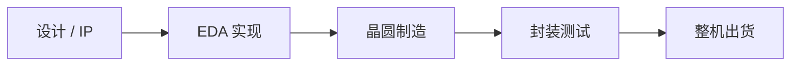

## 一句话定义

半导体产业链是把一颗芯片从想法变成可出货器件的分工网：设计、制造、封装测试、EDA 工具和 IP 核各司其职。

## 作用与功能

设计公司（Fabless）负责规格、架构、电路和版图，把「这颗芯片该干什么」写成可流片的数据。晶圆厂（Foundry）按工艺把电路做到硅片上，不自己定义最终产品功能。IDM 则设计与制造都自己做。封装把裸片保护起来并引出焊盘；测试筛出坏片、标定参数。EDA 是贯穿全程的软件：仿真、综合、布局布线、签核都靠它。IP 是可授权的现成模块，如 CPU 核、USB 控制器、SRAM 编译器，用来缩短设计和验证时间。

钱从哪里来，入门只需记大结构：品牌整机厂买芯片；芯片公司收硅片和授权费；晶圆厂收代工费；封测厂收封装和测试费；EDA 与 IP 厂商收工具许可和版税。卡脖子常见在先进制程产能、光刻与关键材料、高端 EDA、以及高性能 CPU/GPU/接口类 IP。成熟制程、封测和部分特色工艺，国内已能覆盖大量消费与工业需求。对初学者，重要的不是背公司名，而是看清「谁定义功能、谁把电路做进硅、谁保证出厂质量」。遇到新闻里的「缺芯」，先判断缺的是设计能力、晶圆产能、封装材料，还是某一颗关键 IP，结论会完全不同。

## 在全流程中的位置

产业链是行业地图，设计流程嵌在其中。规格到 RTL 发生在设计公司内部；综合与后端仍由设计侧完成，但必须使用晶圆厂提供的工艺库和设计套件（PDK）；GDS 交给晶圆厂流片；晶圆再送到封测厂。EDA 和 IP 从架构阶段就介入，一直用到签核。

## 典型应用场景

做一款可穿戴 SoC：团队买 CPU 和蓝牙 IP，用商业 EDA 完成数字后端，选一家成熟制程晶圆厂流片，再找封测厂做 SiP 或普通 QFN 封装。初创团队往往 Fabless，把制造和封测外包，把精力放在规格、算法和系统软件。高校实验室更常停在 FPGA 或多项目晶圆（MPW），用较低成本验证想法。无论哪种路径，EDA 许可和工艺库条款都要提前谈妥，否则设计做到一半会发现工具或 PDK 用不了。

## 一个小例子

想象开一家「定制蛋糕店」：设计师出配方（芯片设计），中央厨房按配方烤胚（晶圆厂），裱花店装箱（封装），质检员抽检甜度（测试）。配方软件是 EDA，常用馅料供应商是 IP。店自己不建面粉厂，也能卖出蛋糕；但没有厨房和质检，蛋糕到不了顾客手里。

## 本节知识点

- 设计定义功能，制造把电路做到硅片，封测保证可交付。
- Fabless 做设计、Foundry 做代工，IDM 两者兼做。
- EDA 是设计到签核的工具链，不是芯片本身。
- IP 是可复用的电路模块，用授权换周期。
- 利润和风险分布不同：品牌、设计、代工、工具各吃一段。
- 先进制程、高端 EDA 与核心 IP 常被视为供应链瓶颈。
- 读新闻时先判断卡在设计、制造还是封测，避免混为一谈。
