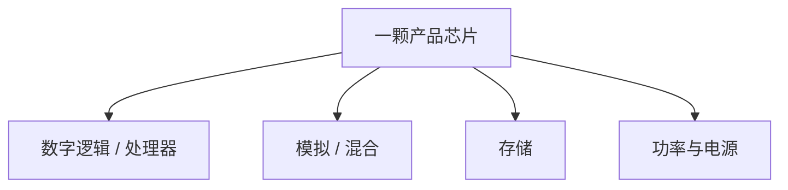

## 一句话定义

芯片可按信号形态和职责分类：数字、模拟、数模混合、存储、功率和处理器，是入门最常用的几把尺子。

## 作用与功能

分类是为了选对设计方法和团队，不是为了贴标签。数字芯片处理 0/1，用时钟对齐操作，流程以 RTL、验证、综合、后端为主。模拟芯片处理连续电压电流，关心噪声、匹配、线性度，主战场是电路图、仿真和版图。混合信号芯片两者都有，ADC/DAC、电源管理、射频前端是典型代表。存储芯片专管「记住」：DRAM、SRAM、Flash 的单元结构和外围电路各不相同。功率芯片管电能变换与驱动，耐压、散热和可靠性权重很高。处理器则是能执行指令的数字（或异构）核心，CPU、GPU、NPU、MCU 都属这类，常作为 SoC 的大脑。

还可以按应用横切：消费电子看功耗和成本，通信看吞吐和接口，汽车看功能安全和寿命，工业看温宽和供货年限。同一颗 MCU，既是处理器，也带模拟外设和 Flash，说明真实产品常常跨类。入门时先抓住「主业」：它主要在算、在采、在存，还是在管电。分类还会影响招聘：数字岗看 RTL 与验证，模拟岗看电路与版图，存储岗看阵列和良率，功率岗看器件与热。简历和项目介绍里写清类别，对方才知道你处在哪条技术栈上。

## 在全流程中的位置

分类发生在立项和规格阶段。选错类别，后面会用错工具链：数字团队去调运放，或模拟团队去堆 UVM，都会事倍功半。全书后续章节按数字主流程展开，模拟与 FPGA 另开专篇，就是因为分类决定了学习路径。

## 典型应用场景

手机里能同时看到几乎所有类别：应用处理器、DRAM、电源管理、射频收发、闪存。电动车里有主控 MCU、功率逆变模块、电池管理混合信号芯片。路由器偏数字交换与高速接口；助听器偏低功耗模拟前端加小型数字核。采购或做竞品分析时，先归类，再比工艺和接口，不容易被参数表带偏。

## 一个小例子

把芯片比作厨房设备：处理器是厨师长，按菜谱（指令）调度；数字逻辑是按节拍切菜的流水线；模拟是火候和调味，连续可控；存储是冰箱和备菜柜；功率是煤气与电机，把能量送到锅里。一桌宴席（SoC）往往请全套班子，而不是只请一位厨师。

## 本节知识点

- 数字管离散逻辑，模拟管连续量，混合信号二者交接。
- 存储、功率、处理器是按职责分出的常用大类。
- 真实芯片常跨类，先看「主业」再看外设。
- 应用领域会改约束：汽车、消费、工业侧重点不同。
- 分类决定工具、岗位和验证方法。
- SoC 是多类模块的集成，不是单一类别的替代词。
- 读规格书先判断类别，再比较主频、位宽等数字指标。
