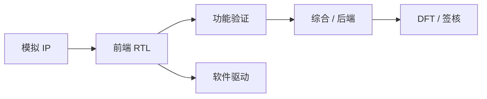

## 一句话定义

芯片项目靠多岗位接力：前端把规格写成电路，验证证明它对，后端把它落到硅上，DFT、模拟、工艺和软件在交接处把关。

## 作用与功能

前端（数字设计）把架构拆成模块，写 RTL，约定接口和时钟复位。验证工程师建激励、检查器和覆盖率，尽量在流片前抓住功能错误。后端（物理设计）做布局规划、摆标准单元、铺时钟、布线，并收敛时序与功耗。DFT 在电路里插入扫描链、内建自测试等结构，让量产后能用自动测试机快速筛片。模拟/混合信号同事负责 PLL、ADC、IO 等连续电路，并提供数字侧能调用的行为模型。工艺与 Foundry 接口人翻译 PDK、设计规则和良率反馈。软件与驱动工程师在 FPGA 原型或仿真器上跑固件，确认寄存器和中断「软件真能用」。

协作的关键是交接物，而不是职称。前端交给验证的是可仿真的设计和功能点列表；验证签字后，综合与后端拿走网表和约束；后端在签核时把版图、时序和电学报告交给项目经理；DFT 模式要写进测试程序；驱动则依赖寄存器说明书（如 IP-XACT 或自动生成的头文件）。会议再多，也替代不了这些「下一棒能打开的文件」。小型团队可能一人兼前端和验证，但交接物仍要在脑子里分开：今天写的是实现，明天测的是规格，不能自己给自己放水。

## 在全流程中的位置

岗位沿时间轴排列，但会重叠。规格阶段架构、软件、市场一起定接口；RTL 阶段前端与验证并行；综合之后 DFT 与后端加入；流片后封测和客户支持上场。入门者不必立刻选终身方向，先认清自己交的是哪一棒、向谁要输入、给谁输出。

## 典型应用场景

一款网卡 SoC：架构定 DMA 和 PCIe 边界；前端写 MAC；验证用随机包打压力；模拟做高速 SerDes；后端在先进封装里挤时钟树；DFT 插扫描并出测试向量；驱动在 Linux 下跑通收发。任何一环「以为对方知道」，都会在联调周爆出来。

## 一个小例子

像拍一部电影：编剧是规格，导演组是架构，演员演戏是 RTL，监制审片是验证，摄影美工是后端，杀青审查是签核，院线上映前的拷贝质检是封测。场记本就是接口文档——谁改了一场戏，下游灯光和剪辑都要同步。

## 本节知识点

- 前端写电路，验证证功能，后端落地到硅片。
- DFT 为量产测试服务，不是可有可无的附加项。
- 模拟、工艺、软件在边界上提供模型、规则和用例。
- 真正的协作靠交接物：RTL、约束、网表、寄存器说明。
- 岗位时间上重叠，需要并行而不是严格串行。
- 入门先认清输入输出，再深入某一专业工具。
- 文档过期等于接口损坏，联调成本会陡增。
