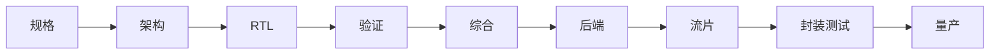

## 一句话定义

从规格到量产，是把「要一颗什么样的芯片」逐步变成可重复制造、可测试、可出货器件的一条主时间轴。

## 作用与功能

规格写清功能、性能、功耗、面积、接口、可靠性和成本红线。架构把规格拆成模块、总线、存储层次和软硬件边界。RTL 用硬件描述语言实现数字行为。验证用仿真、形式化等方法证明「该做的做了、不该做的没做」。综合把 RTL 映射成工艺库里的门级网表。后端完成布局、时钟树、布线，并满足时序与电学约束。DFT 保证出厂能测。流片把版图交给晶圆厂做光罩和晶圆。封装把裸片变成可焊接器件。测试用自动设备筛片、修调和分档。量产则把良率、供货和变更控制做成日常运营。

这条链上每一步都在「花钱换确定性」。规格错了，后面全错；验证不够，硅片上才发现；时序没签核，高温会失效；测试覆盖不足，客户现场才爆。入门不必记住每个工具命令，但要能沿着这条轴讲清：现在卡在「想清楚」「做出来」「证出来」还是「造出来」。向别人介绍项目进度时，与其说「芯片快好了」，不如说「RTL 已冻结、验证覆盖还差最后一类场景」或「版图已签核、等待流片档期」。

## 在全流程中的位置

这是全书的总地图。Part 2 会把数字段拆开细讲；FPGA 在「综合之后」分叉为比特流；模拟在架构之后走电路与版图支线。读后面任何一章，都可以回到这张图，看它上下游是谁。

## 典型应用场景

消费电子芯片可能一年迭代一版，强调进度和成本。汽车芯片要经历更长的验证、失效分析和认证，量产爬坡更慢。科研 MPW 只流少量晶圆，重点是「第一次硅是否活」。FPGA 产品则可能跳过定制光罩，用配置文件直接进入板级生产和测试。同一张大图，不同产品会在某些站停留更久，但站的顺序很少颠倒。

## 一个小例子

把做芯片想成盖地铁：规格是「要通哪几站、高峰运多少人」；架构是线路和换乘方案；RTL 是车站施工图；验证是空载试车；综合和后端是把图纸落到轨道和隧道；流片是浇筑；封装测试是通车验收；量产是按时刻表天天跑还要检修。少画一张换乘图，后面每座车站都可能对不上。

## 本节知识点

- 主轴是规格→架构→RTL→验证→综合→后端→流片→封测→量产。
- 每一步都在降低「做成后才发现错」的风险。
- FPGA 在实现阶段分叉，通常不走定制光罩。
- 模拟与数字在架构后使用不同实现路径。
- 量产不只是多做几片，还包括良率、测试和变更控制。
- 卡住时先判断属于定义、实现、证明还是制造。
- 后续章节都是这条轴上某一站的放大。
