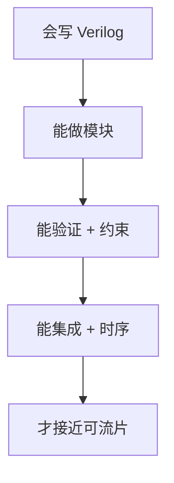

## 一句话定义

入门误区，是把芯片设计里的「一部分技能」误认成「全部工作」，或把宣传口径当成工程规律。

## 作用与功能

澄清误区能帮你选对学习顺序，也避免在面试和项目里说外行话。最常见的一句是「会写 Verilog 就会做芯片」。Verilog 只覆盖数字前端的描述能力；验证、约束、时序、可测性、物理实现和封测，每一项都能让一颗「功能仿真通过」的设计在硅上失败。另一句是「FPGA 等于芯片设计全部」。FPGA 是极好的入门和原型平台，能练 RTL、时序和板级调试，但它不代替光罩、Foundry 规则、签核和量产测试。还有「工艺节点数字越小一定越好」：更先进的节点通常晶体管更密、同性能下功耗可更低，但光罩贵、漏电和设计规则更苛刻，对模拟、高压、成本敏感产品，成熟制程往往更合适。

此外，「仿真过了就能流片」忽略了覆盖率和边角条件；「后端只是自动布局布线」低估了 floorplan 与收敛迭代；「IP 买来插上就能用」忽略集成、时钟、验证和软件。把这些坑提前标出来，比多背几个术语更有用。还有一种隐性误区：觉得芯片是纯硬件，软件可以后补。寄存器、中断和启动流程若不在规格里预留，驱动团队会在硅后才发现「硬件开了门却没给钥匙」。

## 在全流程中的位置

误区章节放在全景之后、数字细流程之前，作用是校正预期：你将进入的是一条多岗位长链，而不是一门编程课。后面读 RTL、验证、STA 时，可以用本节当「防夸大滤镜」。

## 典型应用场景

自学路径规划：先用 FPGA 建立数字直觉，同时补验证和时序，而不是只刷语法题。职业沟通：向硬件经理汇报时，区分「FPGA 原型成功」和「ASIC 可流片」。选型讨论：不要只因为宣传 5nm 就否决 28nm 电源或传感器芯片。带新人时也可以用这张「不是清单」当体检表，避免一上来就陷入语法细节而看不见流程。

## 一个小例子

有人用开发板点亮流水灯，便以为下周能出手机芯片。更接近现实的路径是：流水灯证明你会用工具；UART 和外设证明你会接口；带总线的小 SoC 证明你会集成；再补验证计划、时序收敛和一版 FPGA 压力测试，才勉强摸到「数字前端入门」。ASIC 量产还在这之后。

## 本节知识点

- 写 RTL 只是数字前端的一部分，不是芯片设计全部。
- FPGA 擅长学习与原型，不能等同 ASIC 全流程。
- 更小的工艺节点不等于对每个产品都更好。
- 仿真通过不等于覆盖充分，更不等于硅片成功。
- 后端和 DFT 有独立的工程难度。
- 商业 IP 仍需集成、验证和软件配合。
- 用「现在处在哪一站」代替「我会不会写代码」来评估进度。
