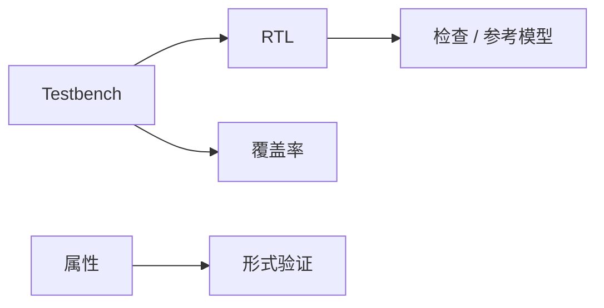

## 一句话定义

功能验证用激励、检查和覆盖率（必要时加上形式化方法）证明 RTL 的行为符合规格，尽量在流片前抓住逻辑错误。

## 作用与功能

仿真是最直观的手段：把设计放进软件模型的时间轴里，一拍一拍看波形。Testbench 负责产生输入、采集输出、判断对错，有的还模仿外部存储器或总线设备。小模块可以用定向用例：复位后读寄存器、发一个字节。系统级更常引入受约束的随机激励，把「合法但奇怪」的组合砸向设计。UVM 是一套常见的 SystemVerilog 验证方法学，把激励、驱动、监测、参考模型和分数板（scoreboard）搭成可复用环境；入门先理解角色，不必先背完整类库。

覆盖率回答「测到了吗」：代码覆盖看行和分支有没有跑到，功能覆盖看规格里的场景有没有打中。覆盖率高不等于没 bug，但覆盖率低一定说明有盲区。形式验证用数学穷举部分属性，例如「这两个信号不会同时有效」，适合协议和关键互斥，补随机仿真的漏洞。验证计划把功能点、优先级和退出标准写下来，避免「看起来波形挺好」就签字。发现缺陷时要区分：是规格含糊、参考模型错了，还是 RTL 真错。前两种不改设计，第三种才值得改代码并回归。

## 在全流程中的位置

验证与 RTL 编码并行，是数字流程里耗时最长的段落之一。模块级通过后做子系统和全芯片；综合后还可做门级仿真，确认时序和 DFT 插入没有改功能。FPGA 原型和仿真加速器用来跑软件级场景。没有验证签字，不应进入流片决策。进度会上与其报「还在仿真」，不如报「还剩哪几条功能覆盖，阻塞在哪类激励」。

## 典型应用场景

UART 验证：随机波特率配置、打断、溢出。总线互连：outstanding 传输、错误响应、复位中途。缓存一致性：多核同时读改写。安全模块：非法地址必须报错且不泄密。每个场景都要把「期望」写成可自动判定的检查，而不是靠人眼扫波形。

## 一个小例子

像验收一辆自动售货机：testbench 是假装顾客和补货员；定向用例是「投币买一瓶」；随机用例是「连按、退币、断电再上电」；覆盖率是货道和币种是否都试过；形式验证是证明「没投币绝不会出货」。只看一次成功出货，不能叫验收完成。

## 本节知识点

- 验证要同时具备激励、自动检查和覆盖度量。
- Testbench 包裹设计，模仿真实或合法的外界。
- UVM 是可复用验证环境的常见骨架，先学角色再学细节。
- 覆盖率揭示盲区，不能单独证明正确。
- 形式验证适合关键属性，与仿真互补。
- 验证与设计并行，流片前必须有退出标准。
- 门级仿真和 FPGA 原型用来补软件级与时序相关问题。
