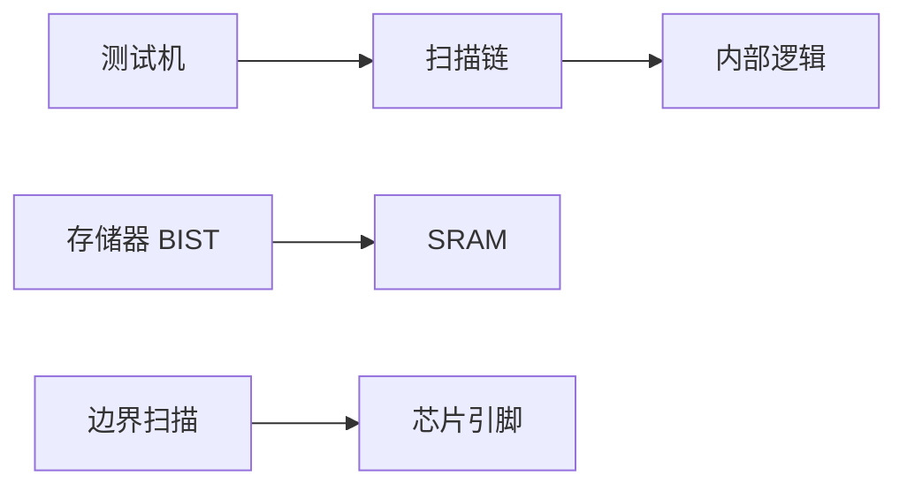

## 一句话定义

可测试性设计（DFT）在电路里预留测试结构和模式，让量产后能用自动设备高效发现制造缺陷。

## 作用与功能

芯片出厂不是「设计对了就每颗都好」。光刻缺陷、颗粒、过孔不良，都会让某一颗硅片功能异常。若只从产品引脚当黑盒穷测，测试时间会不可接受，内部节点也够不着。DFT 的核心想法是：设计时就为测试开门。扫描链把触发器串成移位通道，测试机把向量移入、捕获响应、再移出，从而观察内部状态。BIST（内建自测试）让芯片自己产生激励并压缩结果，常用于存储器（MBIST）和部分逻辑，减少对外向量依赖。边界扫描（如 IEEE 1149.1 / JTAG）在芯片引脚旁做扫描单元，用于板级互联测试和调试入口。

DFT 会占用面积、端口和一点时序预算，还会增加验证工作：测试模式不得破坏功能模式。换来的是更短的测试时间、更高的缺陷覆盖、以及量产能分档和诊断。不做 DFT 的小规模学术芯片偶尔能靠功能测试过关，量产消费或汽车芯片几乎不会这样赌。测试压缩、扫描使能和测试时钟，都要在规格里留端口和模式，不能等后端插链时再临时加 pin。和功能验证分工也很清楚：验证问「设计对不对」，DFT 问「这颗硅片有没有做出缺陷」。

## 在全流程中的位置

DFT 规划从架构就开始（要几根测试时钟、哪些存储器做 BIST），插入动作多发生在综合前后，并与物理设计协同，避免扫描链绕路破坏时序。签核要包含测试模式的 STA。流片后，测试向量交给封测厂的 ATE。JTAG 还通向软件调试接口。

## 典型应用场景

消费 SoC：全扫描加存储器 BIST，压缩向量以控制测试成本。汽车芯片：更高覆盖目标和诊断分辨率。板级生产用边界扫描查虚焊。实验室 FPGA 较少走完整 ASIC DFT，但仍常用 JTAG 下载和调试。量产报价时，测试时间按秒计费，扫描压缩和 BIST 往往直接决定单颗测试成本，而不只是「多占一点面积」。

## 一个小例子

普通考试只能看最终答卷；扫描链像允许老师抽查演草本：先把中间步骤移出来看。BIST 像考生自带答题卡和标准答案，自己对完只交一个「通过/失败」签名。边界扫描则是检查桌椅有没有接错线，不管答题内容。

## 本节知识点

- DFT 解决的是制造缺陷检测，不是替代功能验证。
- 扫描链让内部寄存器可移入移出。
- BIST 把部分测试搬进芯片，常用于存储器。
- 边界扫描服务板级互联和调试入口。
- DFT 有面积和时序代价，换覆盖率和测试时间。
- 测试模式必须单独验证，且参与 STA。
- 量产向量最终交给 ATE 和封测厂。
