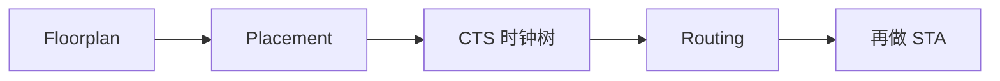

## 一句话定义

物理设计把门级网表变成硅片上的几何版图：规划位置、摆放单元、生成时钟树并完成布线。

## 作用与功能

到这一步，设计从「逻辑连接」变成「在晶圆上占地方」。Floorplan（布局规划）决定芯片外形、电源环、宏模块（存储器、模拟 IP、IO）的座位和通道。位置错了，后面再聪明的工具也难救：存储器堵在中间，总线要绕远，时序和拥塞一起爆。Placement（单元布局）把标准单元摆进行，靠近相关逻辑，躲开拥塞热点。CTS（时钟树综合）用缓冲器和对称走线把时钟送到成千上万个触发器，控制偏斜和插入延迟，否则 STA 里建立/保持会集体告警。Routing（布线）在多层金属上把信号和电源真正连起来，遵守间距、通孔和天线规则。

物理设计是迭代而不是单向流水：布线后延迟变了，要再跑 STA；电源网络压降大了，要加条带；拥塞了，要重摆或改 floorplan。入门记住四段职责即可，不必先学某一家工具的菜单。功耗、可制造性和可测性扫描链，都会在这一阶段变成真实的金属形状。和前端沟通时，后端最常要的不是「再优化一下」，而是更松的周期、更少的跨越全芯片的关键网，或把大宏的位置提前谈定。

## 在全流程中的位置

物理设计接在综合（和 DFT 插入）之后，签核之前。输入是网表、约束、库、LEF/技术文件和 IO 规划；输出是带寄生参数的版图和更准确的时序、功耗数据。FPGA 的「实现」也有布局布线，但资源格子是厂家预制的，不像 ASIC 从空白行长起来。

## 典型应用场景

小 MCU 在成熟制程上 floorplan 相对从容，重点是 IO 和存储器对齐。手机 SoC 要把 CPU、GPU、NPU 和多层缓存拼成几平方毫米，时钟域和电源域密布。高速接口附近要预留模拟硬核和干净电源。任何项目里，过早忽略电源规划，都会在后期付出重复迭代。新手看后端界面容易被颜色和密度图吓到，先问三句就够：宏放对了吗、时钟偏斜多大、哪几条网最堵。

## 一个小例子

像布置一座商场：floorplan 是定各楼层主力店和电梯井；placement 是把专柜摆进走道；CTS 是装一套让所有店铺同时响铃的广播时钟；routing 是铺电缆和通风管，既不能交叉打架，也不能让尽头店铺断电。图纸好看不算完工，消防和供电验收通过才算。

## 本节知识点

- Floorplan 决定宏、IO、电源和通道的大座位。
- Placement 摆标准单元，影响拥塞和路径长度。
- CTS 把时钟同步送到寄存器，控制偏斜。
- Routing 在金属层完成真实互连并遵守工艺规则。
- 物理设计与 STA、电源分析反复迭代。
- 输入是网表和工艺文件，输出是可签核版图。
- FPGA 实现类似四段，但格子和资源是预制的。
