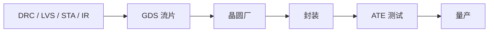

## 一句话定义

签核是流片前的最后合格判定，随后把版图交给晶圆厂制造，再经封装和 ATE 测试进入量产。

## 作用与功能

签核回答：这版数据能不能拿去花钱开光罩？DRC 检查几何是否违反工艺设计规则，例如间距、宽度、密度。LVS 对照原理图/网表与版图，确认没有错连、短路、漏器件。STA 在多角多模下确认建立/保持和接口时序。IR drop 看电源网络在开关高峰时是否把电压砸得过低，从而让延迟恶化或逻辑出错。此外还有天线、电迁移、良率相关的检查。全过之后导出 GDS（或 OASIS）等版图数据库，连同层映射交给 Foundry，这一动作叫流片（tapeout）。

晶圆回来是裸片。封装提供机械保护、散热和通向电路板的焊球/引脚，也影响高速信号和成本。ATE（自动测试设备）加载 DFT 向量和功能套件，做筛片、修调、分档。只有测试程序、质量标准和供货节奏都稳定，才叫量产，而不是「实验室收到几片样品」。样品阶段暴露的问题要分类：设计缺陷、工艺偏差、封装寄生还是测试程序误杀，处理方式和是否改光罩完全不同。

## 在全流程中的位置

这是数字主流程的收官，也是和制造、封测产业链的交接点。之前所有 RTL、验证、综合、DFT、物理设计的质量，都在这里变成「能否开光罩」的决策。流片后改设计意味着新的光罩费用和月份级周期，所以签核清单通常由项目、设计、工艺接口共同签署。

## 典型应用场景

MPW 共享光罩，签核项目较少但同样不能省 LVS/DRC。消费芯片追求尽快爬良率，测试时间直接算进成本。汽车和工业还要可靠性试验和失效分析闭环。先进封装（如芯片组合成 SiP）会让「一颗产品」对应多块硅，签核和测试计划更复杂。项目经理常把 tapeout 当成终点，工程上它只是制造的起点：光罩、晶圆周期和第一次硅回来的调试，都还在后面。

## 一个小例子

签核像航班放行：DRC 是跑道和机身尺寸合规，LVS 是乘客与舱单一致，STA 是各枢纽衔接时间够，IR drop 是油压在起飞功率下不掉。GDS 是交给塔台的飞行计划。封装是登机廊桥和蒙皮，ATE 是起飞前检查单。放行签字后返航改设计，比在登机口改座位贵得多。

## 本节知识点

- 签核用 DRC、LVS、STA、IR drop 等证明版图可制造且可工作。
- GDS/OASIS 是交给晶圆厂的版图交付物。
- 流片意味着开光罩，改设计成本急剧上升。
- 封装把裸片变成可贴装器件，并影响电热性能。
- ATE 执行 DFT 与功能测试，负责筛片和分档。
- 样品成功不等于量产，还要良率和变更控制。
- 这一站同时结束设计流程、启动制造交付。
