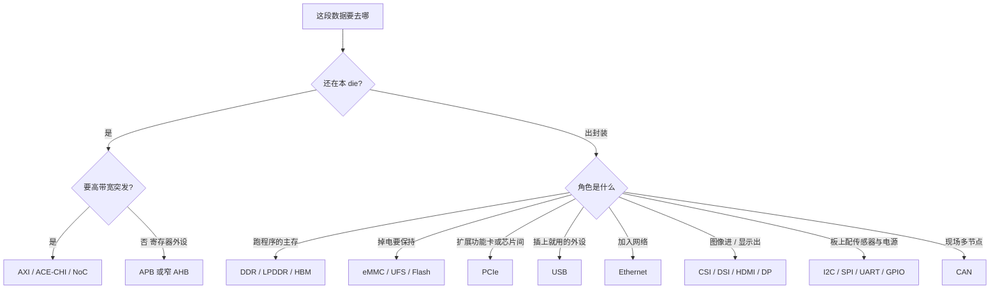

## 一句话定义

协议选型是按带宽、距离、功耗和是否留在片上，给每个数据口挑选「互连骨架、存储、高速对外、板级低速」四类落地方式，而不是按名词时髦程度打分。

## 作用与功能

前面各章把协议拆成了 Controller + PHY + 驱动。选型要回答的是：这段数据该走哪一类口。先看距离：还在同一颗 die 里，用 AXI/AHB/APB 或 NoC，没有板级 PHY。要出封装当运行内存，用 DDR/LPDDR/HBM。要出板到另一颗芯片、插槽或线缆，用 PCIe/USB/Ethernet 或多媒体高速口。只在 PCB 几厘米内配传感器和电源，用 I2C/SPI/UART。再看带宽：Gbps 级像素和存储通道不能塞进 I2C；kbps 级温度值也不该占用 SerDes。再看功耗与常开需求：始终在线的管理通道倾向低速、低翻转；突发搬运会倾向宽 AXI 或高速串行并在空闲时关 PHY。最后看软件生态：需要即插即用选 USB，需要组网选 Ethernet，需要存储器语义选 PCIe，需要多从配置选 I2C。

一张地图比一串缩写有用。下图从「数据还在哪」出发，落到常见协议族。表中带宽是数量级直觉，不是规格书峰值。

| 场景直觉 | 距离 | 带宽数量级 | 功耗倾向 | 常见落地 |
| --- | --- | --- | --- | --- |
| CPU 访 SRAM/寄存器 | 片上 | 随总线位宽 | 随翻转 | AXI/AHB/APB |
| 多核共享缓存 | 片上 | 高 | 中高 | ACE/CHI + 可选 NoC |
| 运行内存 | 封装/模组 | 很高 | 高 | DDR 家族 Controller+PHY |
| 系统盘/相册 | 板级 | 中高 | 中 | UFS/eMMC + 驱动栈 |
| 显卡/SSD | 插槽/板 | 很高 | 高 | PCIe |
| 调试打印 | 板级 | 很低 | 很低 | UART |
| 配 PMIC/EEPROM | 板级 | 低 | 低 | I2C |
| 相机/屏 | 排线 | 高 | 中高 | MIPI CSI/DSI |

## 在全流程中的位置

选型发生在规格和架构冻结期，之后会锁定 IP 清单、管脚、封装、时钟树、电源域和软件栈。后面的 RTL、验证、后端只能在已选协议里优化，很难廉价更换「以太网改 PCIe」这类决策。成本评审也必须同时算 SerDes 数量、PHY 面积和认证费用。协议地图因此是架构文档的首页之一，不是实现阶段的边角料。

## 典型应用场景

可穿戴：片上 APB 外设 + LPDDR 或只靠 SRAM + BLE 模组，几乎不上 PCIe。车载域控：片上 NoC、LPDDR、多路 CAN/Ethernet、摄像 CSI。PC 平台：CHI/AXI、DDR、大量 PCIe、若干 USB 与以太网。同一张地图，圈出的子集不同。回顾清单时问四句：还在片上吗？是主存还是文件？人对着插还是机器组网？能不能接受毫瓦级常开？

## 一个小例子

做一颗摄像头网关：传感器到 ISP 走 CSI（排线、高带宽）；ISP 到 DDR 走 AXI（片上突发）；CPU 配传感器走 I2C（低速）；码流出门走 Ethernet（组网）；调试留 UART。有人提议「全部改 USB」——带宽够，但传感器模组生态、实时性和驱动模型都不对。正确做法是按距离和角色各选一口，而不是追求协议种类最少或最新。

## 本节知识点

- 选型四轴：带宽、距离、功耗、是否片上；先定角色再定协议族。
- 片上用 AXI/AHB/APB/NoC；出封装主存用 DDR 家族；出板高速用 PCIe/USB/Ethernet/多媒体。
- 板级配置与调试用 I2C/SPI/UART/GPIO；现场总线用 CAN。
- 落地形态始终是 Controller + PHY（或 pad）+ 驱动，复杂度随速率上升。
- 软件生态和认证成本与电气速率同样能否定一票。
- 一张角色地图比背规格字段更能避免错配。
- 协议一经冻结，IP、管脚、封装和软件栈一起被锁，返工极贵。
---
